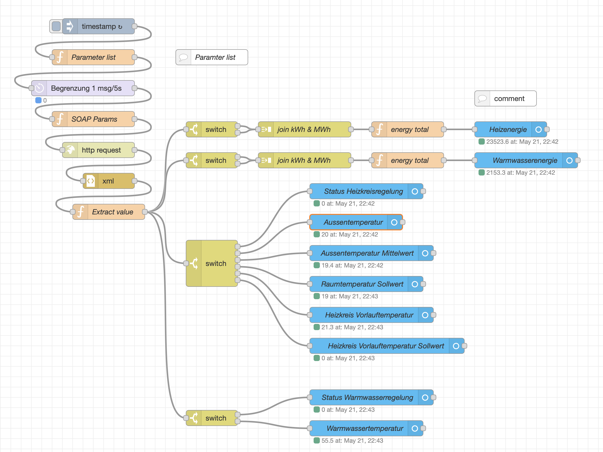

# Ochsner_Home_Assistant

## Idee
Die Betriebsdaten der Ochsner Wärmepumpe werden über Node-RED und dem web2com Interface
ausgelesen und als Sensoren dem Home Assistant (HA) bereitgestellt.

## Voraussetzungen
Home Assistant 2023.5.3
Node-RED aus den Home Assistant Community Add-ons

Um Node-RED mit Home Assistant zu verbinden ist noch eine Integration zu installieren.
Die Anleitung und den Code gibt es hier:
https://github.com/zachowj/hass-node-red​

Die manuelle Installation lässt sich mit dem Add-on "Studio Code Server" durchführen.
Dabei wird unter dem Verzeichnis CONFIG die entsprechende Verzeichnisstruktur angelegt und die 
Dateien mit Drag&Drop kopiert.

## Installation
Der Inhalt der json-Datei kann mittels Kopieren/Einfügen direkt in Node-RED importiert werden.
Es ist nur noch die IP Nummer / Benutzername und Kennwort im Knoten "http request" einzustellen.

## Aufbau des Programms
Über einen Timestamp wird der Ablauf zyklisch gestartet.
Dies triggert eine Parameterliste, die einen Parameternamen mit einer eindeutigen ID verknüpft.
Die ID kann aus dem beigefügten Kommentar entnommen werden, oder man setzt
sich die Sequenz über das web2com interface selbst zusammen.
z.B.
(1) eBus
(2) WPC
(0) Service Report
(1) Wärmepumpe
(125) Soll+Istwerte
(0) Status
...

Daraus ergibt is dann:
Status -> 1/2/1/125/0

Da das web2com Interface nicht alle Parameter gleichzeitig abarbeiten kann wird nur alle 5 Sekunden ein Anfrage durchgelassen.
Die ID-Sequenz wird in eine SOAP Anfrage eingebaut und an das web2com gesendet.
Aus der Antwort wird danach dann der Messwert extrahiert.
Jeder HA-Sensoren kann nur einen Wert abbilden, so dass die einzelnen Antworten über die 
switch Anweisungen gefiltert werden. Hier muss der gleiche Name wir in der Parameterliste verwendet werden.

Ein HA-Sensor benötigt einen Name, eine Konfiguration und einen Zustand.
Am Bsp. der Aussentemperatur werden die Parameter erläutert.

- Name: Aussentemperatur
- Entity config: Über den Eintrag "Neuer Typ" kann ein neuer Sensor angelegt werden.
- State: msg.payload.state

In einem nächsten Schritt wird die Entity konfiguriert (über den Bleistift neben Entity config)
In diesem Fenster besteht auch die Möglichkeit den Sensor für HA zu löschen (Button oben links).

- Name: Aussentemperatur
- Server: Home Assistant
- Device web2com (Hier kann man Sensoren einem Device zuordnen)
- Type: sensor
- Friendly name: w2c Aussentemperatur (Der Präfix "w2c" hilf im HA die Sensoren leichter zu finden.)
- Category: diagnostic (Hier kann ma festlegen wo der Sensoren im HA angezeigt werden sollen.)
- Device class: temperature
- Unit: °C
- State class: measurement (Ist es ein Messwert oder ein aufsummierter Wert?)

Nachdem alle Einstellung durchgeführt sind kann die Node-RED Konfiguration übernommen werden.

